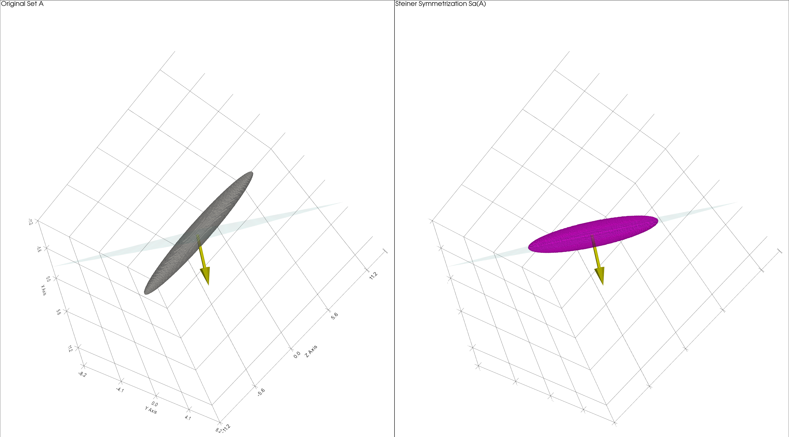

# Steiner Symmetrization
A simple 3D visualization of the Steiner Symmetrization for (inequality) solution sets, voxel based.
## Requisites 
```
scipy 
pyvista
numpy
```
## Usage
On run, the user will be asked for the inequality that defines the solution set and the vector that is ortogonal to the symmetrization plane.

__Example:__
>--- Steiner Symmetrization - 3D Visual Representation ---
>
>Define Set A (Implicit Equation): ```x**2+y**2+(z/8)**2-1```
>
>Vector a (Direction): ```1,1,-1```
>
>Analyzing fibers Lb^a in a fixed domain of size [-10.0, 10.0]...



## Changing the quality of the representation
Since the visualization is voxel based, it ends up being a rough approximation of the actual set. One can change the quality of this approximation by changing the following variable values.
```
limit = 10.0 # Domain Limit
res = 400 # Visual resolution for a smooth manifold
map_res = 300 # Makes the symmetrization more accurate relative to the quality of the original object, defined above
```
## Test Inequalities 
Some inequalities are provided in the file [ineq.txt](https://github.com/matias-math/Steiner-Symmetrization-/blob/main/ineq.txt)
